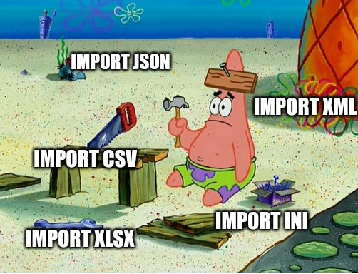

# File Parser

>Sei stanco di dover scrivere sempre lo stesso codice per aprire file **csv** o **xlsx** ?  



> Ogni tanto ti trovi ad aprire dei **json** o degli **ini** di configurazione ?

> Getti la spugna quando ti trovi davanti a degli **xml** ?

Bene, allora **FileParser** puo' fare al caso tuo!


## Che cos'e'?
**FileParser** e' una libreria Python che ti permette di aprire qualsiasi tipo di file e convertirli in un meta-dizionario.

Attualmente **FileParser** supporta i seguenti tipi di file: **json, csv, xlsx, ini, xml**, ma ne potrebbe contenere molti altri!

## Come funziona?
Facile, se vuoi parsere dei json cosi'

```{.py}
from file_parser import FileParser

fp = FileParser()
fp.read('file.json')
_res = fp.parse('json')

print(_res)

```

Banale no ?

Be', la cosa forte e' che puoi usare lo stesso metodo per qualsiasi tipo di file supportato!

```{.py}
# ini
_res = fp.parse('ini')

# xml
_res = fp.parse('xml')

# xlsx
_res = fp.parse('xlsx')

# csv
_res = fp.parse('csv')

```

## Dimmi di piu'
Con **FileParser** si possono fare tante altre cose, come:
* convertire un tipo di file in un altro (xml -> json, xlsx -> csv )
* parsare del testo grezzo in un formato specifico (raw -> json )
* importare agevolmente dei dati xlsx, modificarli e salvarli in csv 

>**E tanto altro!**

Se sei interessato guarda pure altri esempi in `/example`

---

## Classics Usage

```
from file_parser import FileParser
from typing import Dict, List
fp = FileParser()
fp.read('data.xlsx')

_content:List[Dict] = fp.parse('xlsx')
```

---
## Installazione

**FileParser** richiede `python` >= `3.8` 


```{.sh}
make install
make build
make pip-install # per installare la libreria
```
